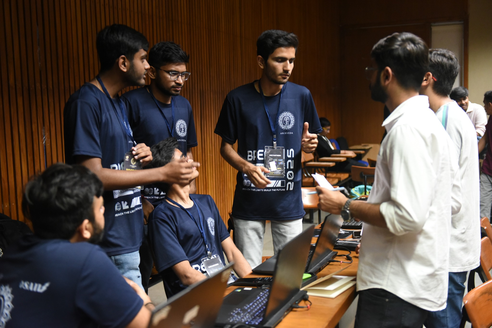
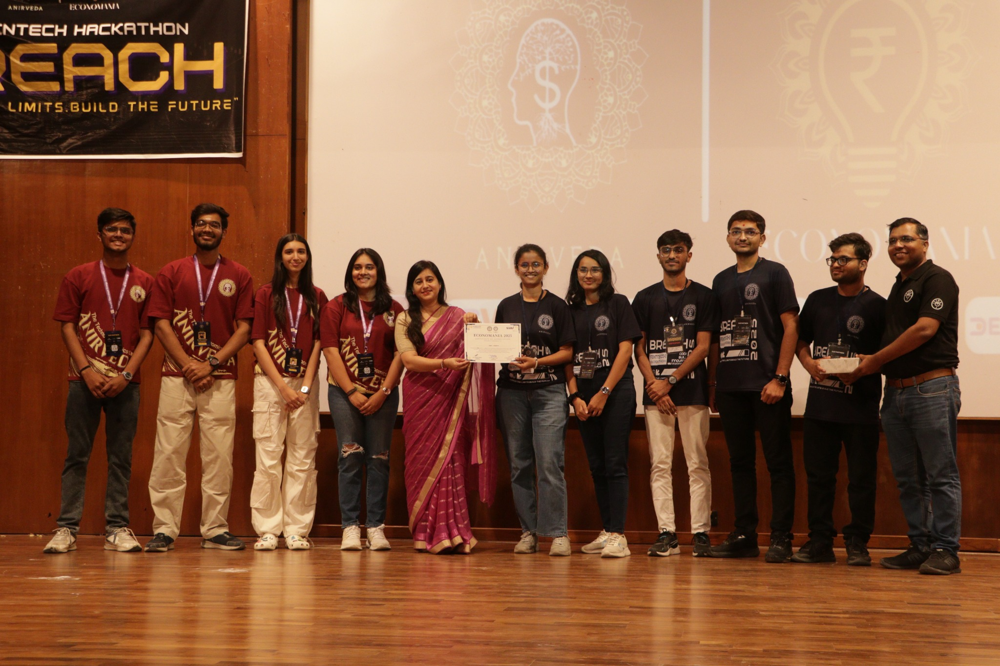
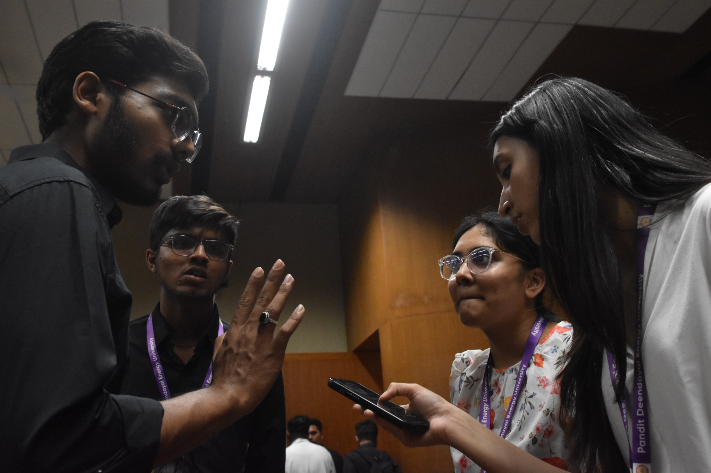
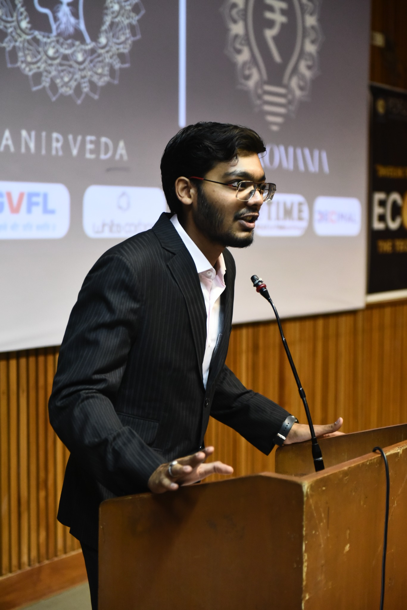
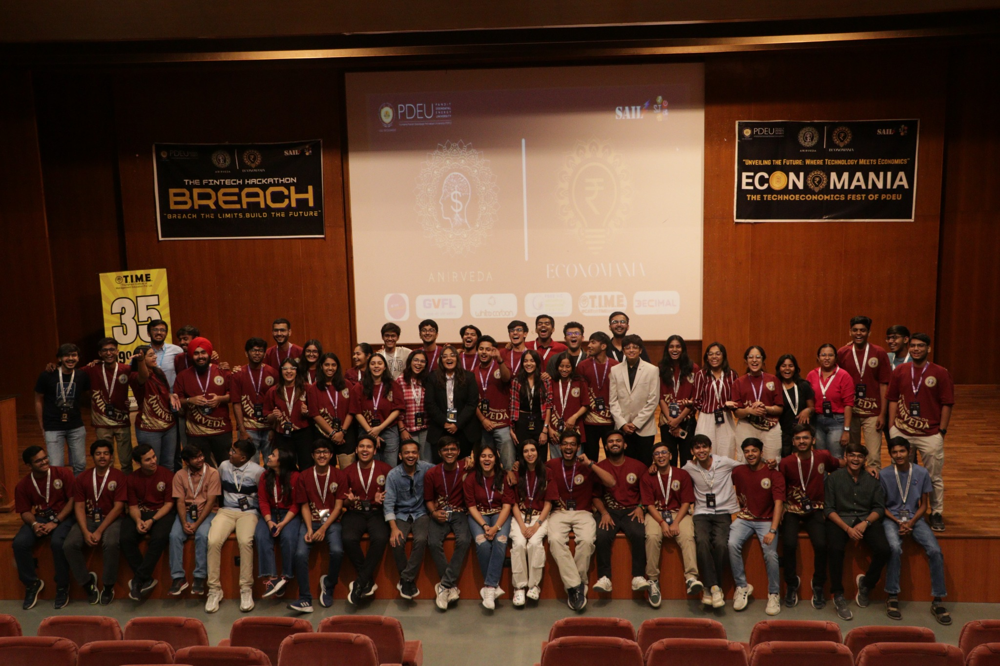
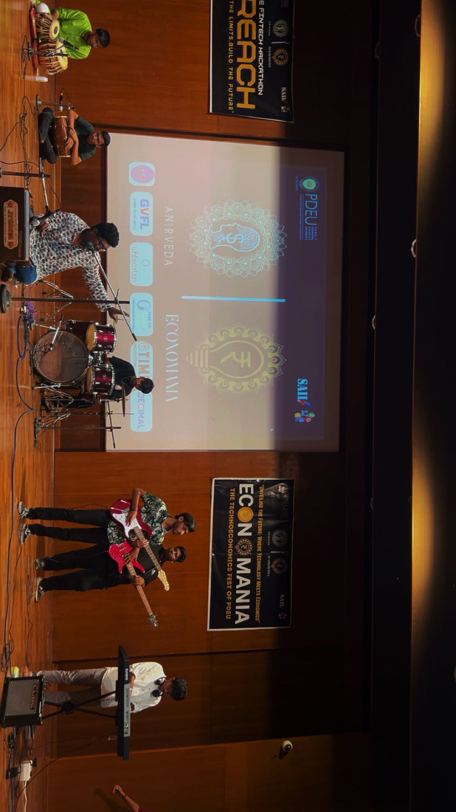

# ECONOMANIA 2025 & BREACH 2025 🚀  
### Gujarat’s Largest Fintech Hackathon & PDEU’s Flagship TechnoEconomics Fest  

---

## 🌟 Overview  
**Economania 2025**, hosted by Anirveda – The TechnoEconomics Club of PDEU, was a **three-day national-scale festival** blending economics, technology, and innovation.  
The highlight event was **BREACH 2025**, Gujarat’s largest fintech hackathon, with 500+ registrations across 52 universities, ₹6.5L raised in funds/sponsorships, and 20+ industry experts as judges and mentors.  

📌 **Milestone:** This was **PDEU’s first-ever hackathon**, and the **first time a student club independently raised ₹6.5 lakhs** in sponsorships and partnerships.  

---

## 👤 My Role — Architect & Vice President  
I was the **architect of the fest** and **Vice President of Anirveda**.  
The project was executed over **6 months**:  

- **Phase 1 (3 months solo):**
  - Designed the **entire event concept** and 3-day format  
  - Defined event categories (hackathon, policy sim, quiz, keynote)  
  - Conducted **market research** and competitive benchmarking  
  - Created the **sponsorship model** and partnership tiers  
  - Drafted branding concepts, visual identity, and theme  
  - Secured **initial approvals** from PDEU, working alone  

- **Phase 2 (3 months with committee):**
  - Led **sponsorship acquisition** (negotiated directly with **GVFL – a venture capital firm**)  
  - Secured **₹6.5L+ sponsorships & partnerships**  
  - Convinced PDEU to **fund meals** and support logistics  
  - Designed **event structure & flow** across 5 major events  
  - Built the **marketing strategy & branding** with Digital Media & Graphics team  
  - Oversaw **participant accommodation plan** for outstation teams  
  - Coordinated approvals, budgeting, and cross-team execution  

👉 While I did the **initial heavy lifting & strategy**, the **80-member committee executed** flawlessly, ensuring scale and success.  

---

## 💡 Skills Demonstrated  
- **Capital Raising & Fundraising** – Raised ₹6.5L+ from corporate, VC, and university sources  
- **Sponsorship Acquisition & Negotiation** – Personally closed deals with GVFL, Decimal, White Carbon, TIME  
- **Leadership & Team Management** – Convincing committee, building structure, leading 80+ members  
- **Approvals & Official Negotiations** – Navigated university bureaucracy, got high-level approvals  
- **Budgeting & Resource Management** – Allocated funds for rewards, logistics, meals, and outreach  
- **Product & Event Management** – Designed hackathon structure, competition flow, participant journey  
- **Branding & Marketing** – Co-created pitch deck, led branding & digital strategy  
- **Fintech Ecosystem Exposure** – Engaged with industry experts, VCs, policy professionals  

---

## 📊 Impact & Key Numbers  

| Metric | Outcome |
|--------|---------|
| **Registrations** | 500+ students from **52 universities** |
| **Finalists** | 50 teams (24.65% selection rate) |
| **Hackathon Winners** | 15 teams (10.27% winning rate) |
| **Sponsorship Raised** | **₹6.5 Lakhs** (record-breaking for PDEU club) |
| **Prize Pool** | ₹1.5 Lakhs + ₹2 Lakhs seed funding |
| **Judges & Mentors** | 20+ industry leaders & academicians |
| **Internship Offers** | 10+ to top teams |
| **Feedback** | 4.38/5 (participants) · 4.75/5 (judges) |
| **Return Intent** | 76.6% participants want to return |

---

## 📅 Event Structure  

- **BREACH 2025** – Gujarat’s largest fintech hackathon (flagship, 52-hour sprint)  
- **Parallel Paradigm** – Techno-economics quiz & puzzles  
- **GalaxEcon** – Space economics strategy challenge  
- **Mock RBI** – Central bank simulation under crisis scenarios  
- **Speaker Session** – Satish Kumar (IIM Calcutta alum, TIME Gujarat Director)  

---

## 🖼️ Gallery  

|  |  |
|------------------------------------|------------------------------------|
|  |  |
|  |  |
|  |

---

## 🔗 Media & Links  
- 📸 [Instagram – Anirveda PDEU](https://www.instagram.com/anirveda_pdeu?igsh=MWwxZTI2cnBpODEyNg==)  
- 📸 [Economania 2025 Post](https://www.instagram.com/p/DOXj_l0kv4S/?igsh=MWx6MW1zOWIxZHp1Yg==)  
- 💼 [LinkedIn Mentions](https://www.linkedin.com/search/results/content/?keywords=breach%20anirveda&origin=CLUSTER_EXPANSION&sid=TFZ)  

---

## 🙌 Credits  
Economania 2025 was powered by **Anirveda’s 80-member core team**.  
- While I served as **Architect & Vice President**, the **collective execution** by Event Management, PR, Sponsorship, Marketing, Content, Design, and Technical teams made this vision a reality.  
- Together, we created PDEU’s **first-ever hackathon**, raised **record sponsorships**, and delivered an **unforgettable national-scale fest**.  

---

## 🚀 Final Note  
Economania 2025 was more than an event. It was:  
- A **proof of concept** that students can raise capital, build partnerships, and run professional-scale projects.  
- A **movement** where innovation met impact.  
- And above all — a reminder that **we don’t do mediocre things.**  

